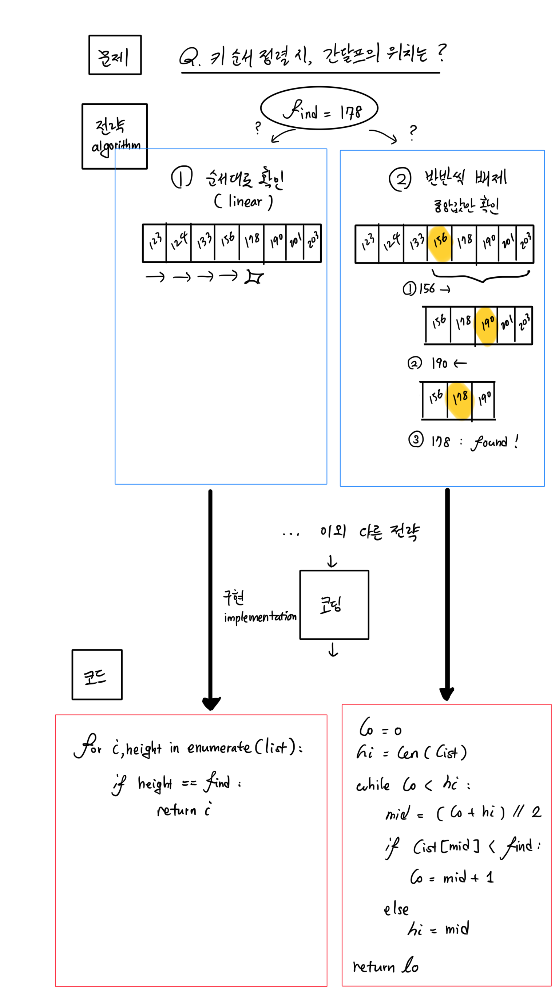

### Coding Practices - Day 1
@TravisAhn100
@anto5710

#### Today's Goals
1. 파이썬 언어의 특성 리뷰
2. 기본 문법 및 원시 데이터 타입 리뷰
3. 기본 데이터 타입들과 반복문을 사용한 간단한 연산 게임 구현

#### Python
* Python은 interpreter형 언어다: *한줄 한줄 내려가면서* 기계어로
  실시간 통역을 하는 언어.
  * <-> C/C++, Java 등은 compiler형 언어. 한번에 전체 코드를 기계어로 변환(compile).
  * 코드량이 많을 경우 interpreter형에 비해 compile하는덴 시간이 좀 더 걸려도
    프로그램 성능은 더 빠를 수 있음
* 메모리 등 내부 디테일은 Python이 알아서 관리

#### Primitive Data Types
기본 데이터 타입들. 어느 프로그래밍 언어든 공통 요소.
|    <br>   | 값     | 만드는 법 |  변환 |
| :---- |      :-----: | :----- | :--- |
| **Int 정수** | -2<sup>31</sup> ≤ `v` ≤ (2<sup>31</sup> - 1) | ```v = 31 // 2```<br> ```v = int(input())``` | ```v = int("문자열")``` |
| **Double 소수** | 아무 소수값[^dec] | ```v = 4 / 5 ``` <br> ```v = random()```[^rad] | ``` v = float("문자열")``` |
| **String 문자열** | 0개 이상의 문자(들) | ```v = "C" + " Foot" ``` <br> ```v = "C" + str(4)```| ```v = str([1, 2, 3, 4])```<br> ```v = str(1 + 2)```|
| **Boolean 부울(대수)** | `True` 혹 `False` | 비교형태(등식/부등식)로 만듦: <br>```v = (1 <= 2)``` <br> 부울 뒤집기: <br> ```v = not v``` |  `<`, `<=`, `>`, `>=`, `==`, `!=` 등 사용하여 비교|

#### Module: random
난수(random number) 생성용 모듈
```python
from random import random
```

* `random()`: 0 ≤ `v` < 1의 값, 즉 [0,1) 안에 있는 값이 나온다.
* `randrange(A, B)`: A ≤ `v` < B인 *정수* 생성

#### Module: time
현재 날짜/시간 확인 및 계산용 모듈
```python
from time import time
```
* `time()`: [Unix Time](https://en.wikipedia.org/wiki/Unix_time)(1970년 1월 1일 0시부터 경과한 시간)을 초 단위 소수로 반환
* `gmtime()`: 현재 [GMT](https://en.wikipedia.org/wiki/Greenwich_Mean_Time)시간을 년/월/일/시/분/초 등으로 구성된 '시간 구조체' (`struct_time `)로 반환
* `localtime()`: 컴퓨터 설정에 따라 *현지* 시간을 '시간 구조체'로 반환

##### Example: Stopwatch
```python
from time import time
t0 = time() # 현재 Unix 시간 (초)

# 뭔가 시간 잡아 먹는 짓을 합니다
for i in range(1000):
        print("""
        해피해피해피 맑은 날~
        우리 가족 손잡고
        함께 가요 이마~트(이마트~)
        행복해요 이마~트
        해피해피해피 이마트
        """)

# (현재 Unix 시간) - (시작시 Unix 시간) == (소요 시간 (초))
spent_time = (time() - t0)
print("걸린 시간: ", spent_time, "초")
```

#### String Formatting
String에 특정 키워드를 넣어 값을 '대입'합니다.

##### Method 1: `string.format(...)`
> `(포맷문자열).format(A, B, C, ...)`

* 포맷문자열에 `{}`를 넣어 `A`, `B`, `C`의 값들을 각각 대입할 수 있다:
  ```python
  print("{}, {}! {}, {}!".format("오케이", "4달러", "오케이", "4달러"))
  ```
  **\> Output**
  ```
  오케이, 4달러! 오케이, 4달러!
  ```
* `{0}`, `{1}`... 등을 사용하여 n번째 값을 특정하여 쓸 수 있다:
  ```python
  print("{0}, {1}! {1}, {0}!".format("오케이", "4달러"))
  ```
  **\> Output**
  ```
  오케이, 4달러! 4달러, 오케이!
  ```

##### 정렬 및 패딩
`{}`가 들어갈 경우 `{}` 안 내용에 `:`부터 시작하여 다음과 같이 덧붙여 정렬 할 수 있다.
> <big>{**:**(<small>패딩문자</small>)(<small>정렬</small>)(<small>너비</small>)}</big>
* 패딩문자를 안 넣을 시 기본적으로 공백문자(`' '`)로 패딩된다.


| <br> | 코드 | 출력 |
|:--------:|:-------:|:-----:|
|좌측 정렬 | ```print("{:*<20}".format("SLBM"))``` | ```SLBM****************```|
| 중앙 정렬 | ```print("{:*^20}".format("SLBM"))``` | ```********SLBM********```|
| 우측 정렬 |  ```print("{:*>20}".format("SLBM"))``` | ```****************SLBM```|
##### Method 2: `fstring(...)`
`f"{VAR}"` 식으로, 변수값을 대입할 수 있다.
* ```python
  name    = "Oppenheimer"
  surname = "Julius"
  midname = "Robert"
  year    = "1904"
  print(f"{surname:<10} {midname} {name} was born in {year}.")
  ```
  **\> Output**
  ```
  Julius     Robert Oppenheimer was born in 1904
  ```

#### Coding vs Programming



같은 문제가 주어졌을 때, 답을 찾는 전략이 여러 가지.
* 여기서 전략을 알고리즘이라 하며, 보통은 pseudocode로 human language로 풀어서 설명하는 것을 선호.
  * 섣불리 키보드에 손을 올리기 보다, 알고리즘을 대강 개요를 짜서, 바로바로 코드로 옮길 수 있도록 미리 구상하는 것이 좋음
* 알고리즘을 실제로 프로그래밍 언어로 작성하여 가동이 되도록 만드는 것을 알고리즘을 구현(implement)한다고 함.
* 이 작성한 코드는 컴파일러/인터프리터 등이 최종적으로 기계언어로 변환되어 실행

#### In-Class Work
랜덤 사칙역산 연습 프로그램

pseudocode 예시:

> while (안 틀렸을 동안):
> * 2개 정수 랜덤 선택
> * 사칙연산 4개 리스트 중 1개 랜덤 선택
> * 선택한 연산자에 따라 정답 확인
> * 정답이 맞으면
>   * 소요 시간 추가. 맞힌 개수 증가
>
> 합산 점수 표시

#### Daily Assignments
1. 사칙연산 게임에 점수 시스템 추가 (맞힌 개수, 소요 시간 기준으로 적당한 점수 계산식 채용).
2. 사칙연산 특성 상 필연적인 버그가 있을 수 있는데, 이에 대한 해결책 구현 (프로그램 튕기지 않고 다음 문제로 스킵하도록).
3. Project Euler: 수학 코딩 문제 웹사이트 1번 문제 풀어보기:
   > https://projecteuler.net/problem=1


[^dec]: 실제론 소수가 이진수로 저장되기 때문에 (1/2, 1/4, 1/8, ... 등 여러 개가 합쳐진 형태로) 2로 딱 떨어지지 않는 경우, 계산할 수록 미세한 오류가 날 수 있다.

[^rad]: 0 ≤ `v` < 1의 값, 즉 [0,1) 안에 있는 값이 나온다.


