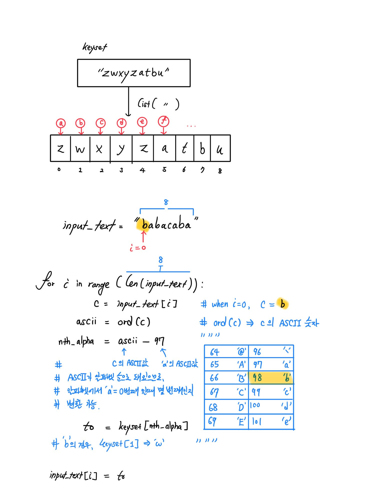

### Coding Practices - Day 2
@TravisAhn100
@anto5710

#### Today's Goals
* Projer Euler - Problem 1 숙제 리뷰
  * Edge Case에 대하여
* 스트링 리뷰 - 카이사르 암호 상위호환, 1:1대응 암호 변환기 만들기
* 반복문 사용하여 간단한 주크박스 만들기

#### Project Euler - Problem 1

> If we list all the natural numbers below $10$ that are multiples of $3$ or $5$
> , we get $3, 5, 6$ and $9$. The sum of these multiples is $23$. Find the sum
> of all the multiples of $3$ or $5$ below $1000$.

##### Student's Response
```python
x=[]
for i in range(0,1000):
    if i%3==0:
        x+=[i]
    if i%5==0:
        x+=[i]
    if i%3==0 and i%5==0:
        x.pop()
print(sum(x))
```
##### Problem 1 - Edge Case
만약 현재 숫자(`i`)가 $3$과 $5$의 공배수일 경우, 위 코드 상에선 `i`가 정답 리스트에
두 번 (중복되어) 추가돼버린다. 이를 만회하기 위해, 공배수의 경우 `i`를 다시 한 번
빼주는 해결책을 추가했다.

#### What is an Edge Case?
**Edge Case:** 프로그램 작성 시 버그는 필연적으로 발생한다.
그 중에서도 예외적인 값 (엄청 크거나, 음수이거나, 0이거나)
버그가 발생하기 쉬운 부분이 흔히 있는데 이를 Edge Case라고 한다.

* 알고리즘을 짜기 전, 가능한 입력의 *종류*를 생각해보자. 예를 들어, 입력이
  숫자일 경우, $0$, 양수, 음수 등이 있고, 리스트일 경우 빈 리스트, 한 개짜리 리스트
  (singleton list), 2개 이상 리스트로 크게 나눌 수 있다.
* 알고리즘을 대강 구상하였다면, 간단한 입력으로 (머릿속이나 종이에 그려가며)
 시뮬레이션을 해 본 뒤, 바로 *Edge Case*, 예외의 경우를 생각해 봐야 한다!!!

대표적으로:
##### Example 1 - Out of Index Range
```python
list = [0, 1, 2, 3]
for i in range(0, 5):
        print(list[i]) ## 오류 발생! 인덱스가 0 ~ 3까지 가야하는데, 4가 포함돼버렸다
```
리스트 등 '인덱스,' 즉 숫자 위치로 값을 찾아오는 식의 자료구조는 인덱스 끝값을
조심해야 한다. 프로그래밍에서 $n$칸 짜리 리스트를 찾아볼 때, 인덱스는 $0$에서
$\textbf{n - 1}$까지 이므로, $n$까지 가면 한 칸밖으로 나가 버리게 된다!

##### Example 2 - Zero Division
프로그래밍에선, 애매한 것을 최대한 배제하려하므로, ' $0$으로 나누기' 같은 애매한
연산은 아예 *금지*시켜 버린다.
```python
print(0 / 0) ### Division by Zero는 금지돼었다 뜨며 프로그램이 튕긴다
```
따라서, 사측연산 프로그램 등의 경우, 항상 *분모* (denominator)가 0이 되는 경우가
있는지 확인 할 것. **베스트 전략은 프로그램이 최대한 안 튕기도록 자연스레 넘어갈 수
있도록 해주는 것이다.**
* 예를 들어, `if` 조건으로 감싸, 분모가 $0$일 경우 아무것도
   안 하고 스킵해버리는 수가 있다.

#### In-Class Work: Caesar Cipher++
##### Caesar Cipher
카이사르 암호(Caesar Cipher)는 가장 널리 알려진 암호화 방식 중 하나로,
텍스트에서 알파벳 `'a'` ~ `'z'`를 각각 n칸 뒤의 알파벳으로 바꾸어 암호화한다.
여기서 $n$ ($0 \leq |n| < 26$)이 곧 암호화 키가 된다.

| From  | a | b | c | d | e |... | z |
| ---- | -- | --| --| --| --|---| -- |
| To    | `x` | `y` | `z` | `a` | `b` |... | `w` |

* `'a'`(0번째 알파벳)을 `'x'`(23번째 알파벳)으로 바꾼다. 즉 $n=23$칸 만큼 오른쪽으로
  알파벳표를 민 것이다.
* `'z'` (25번째 알파벳)의 경우 $23$칸 오른쪽으로 돌리면 $25+23=48$로 알파벳 범위를 넘어가므로
  $26$을 빼주면, 한 바퀴 돌아 $22$(`'w'`)가 된다.


##### Caesar Cipher++
위 방식의 상위 호환인, 카이사르 암호 2.0을 만들어 보자.
알파벳표를 'n'칸 일정하게 돌리는 식으로 암호화하는 대신, 자유롭게 각 26글자 알파벳을
뒤섞어 1:1 대응시킬 수 있도록 만든다.


| From  | a | b | c | d | e |... | z |
| ---- | -- | --| --| --| --|---| -- |
| To    | `z` | `g` | `e` | `f` | `o` |... | `i` |

Caesar Cipher와 다르게, 순서 상관 없이, 마음대로 알파벳을 뒤바꾼 모습이다. 위에 따르면,
원문 input 텍스트에 모든 `'a'` $\mapsto$ `'z'`로 바꾸고, `'b'` $\mapsto$ `'g'`로
바꾸는 식으로 대입한다.

###### Input
* 이런 알파벳 '변환표'인 `keyset`이 입력으로 주어진다고 하자.
예를 들어, `keyset = "zgefo...i"` 일 경우, 위와 같이 0번째 알파벳 `'a'` $\mapsto$
`'z'`로 바꾸고, 1번째 알파벳 `'b'` $\mapsto$ `'g'`로 바꾼다는 것을 압축하여 한 스트링에
표현한 것이다.
* 다음 줄에는 바꿀 원문 텍스트 `input_text`가 한 줄 주어진다.

###### Output
원문 `input_text`를 `keyset`에 맞게 알파벳을 모두 변환하여 출력해보자.

###### Example
`keyset = "sopr", input = "ababac"`

###### Output:
`output = "sososp"`

###### Solution
```python
# 26글자짜리 키 스트링 받음
keyset          = list(input())
# zfehgj .... 26

# 바꿀 스트링
input_to_change = list(input())
# Vertias et Lux

giri = len(input_to_change)

for i in range(giri):
    c              = input_to_change[i]
    ascii_num_of_c = ord(c)              ## 'b' -> 98
    n_th_alphabet  = ascii_num_of_c - 97 ##     ->  1

    target_char    = keyset[n_th_alphabet]   ## b에 바꿀 것이 1번째 칸에 있음
    input_to_change[i] = target_char

print(input_to_change)
```

###### Explanation


예를 들어, `input`을 바꿀 때 첫 글자 `"b"`의 경우, 무슨 글자로 바꿔야 하는지
`keyset`에서 찾는다. 이때, `keyset`은 알파벳 순으로 나열돼 있으므로,
알파벳 순서에 해당하는 위치에서 바로 값을 찾는 것이 가능하다.
예를 들어, `a`는 0번째, `b`는 1번째인 식이다.

##### ASCII Code
American Standard Code for Information Interchange의 약자로, 각종 글자를
컴퓨터 상에서 어떻게 표현할 것인지 정한 것이다.
한 글자당 1바이트(=8비트)를 사용하여 표현하며, 이는 0번째 글짜부터 (2<sup>8</sup> - 1)
번 글짜까지 총 256가지의 글자를 나타낼 수 있다는 뜻이다.


###### Application
ASCII 0번대부터 31번대까지는 시스템 특수신호 문자로, Esc키, Backspace키 등을 포함하며,
대부분의 경우 코드 상에서 사용할 일이 없다.[^tab]

ASCII 코드는 알파벳/숫자 순으로 부여돼있으므로, 위 예시처럼 `'a'가 0이라고 할 때
알파벳이 몇 번째에 해당하는지 알파벳 ⇔ 숫자 변환 용으로 요긴하게 사용할 수 있다.
* **알파벳 → 숫자:**
   * ```ord(alphabet) - ord('a')``` (소문자 전용)
   * ```ord(alphabet.lower()) - ord('a')``` (대,소문자 겸용)

* **숫자 → 알파벳:**
  * ```chr(num + ord('a'))``` (소문자)
  * ```chr(num + ord('A'))``` (대문자)


##### Today's Assignment: Jukebox
[`musicalbeeps`](https://github.com/MaelDrapier/musicalbeeps/tree/master) 모듈을
사용하여 간단한 음악재생기를 만들어보자.

```python
import musicalbeeps as MB

player = MB.Player(volume = 0.5)

player.play_note("A", 0.5) # 0.5초 동안 A4를 연주
```
* `Player.play_note()`로 노트 하나를 개별적으로 연주할 수 있다.
* "CDEFGAB"와 같이 문자열로 여러 노트를 받았을 때, 반복문을 사용하여 이를 순차적으로
   연주하는 프로그램을 짜보자.

[^tab]: Tab키의 경우 텍스트 정렬용으로 가끔 사용되며, `'\t'`라고 쓴다. 줄바꿈 문자 (`'\n'`)
도 자주 사용된다.