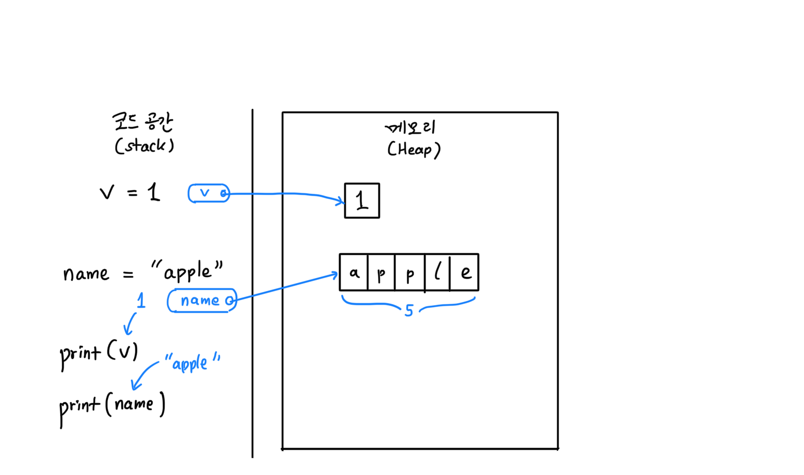
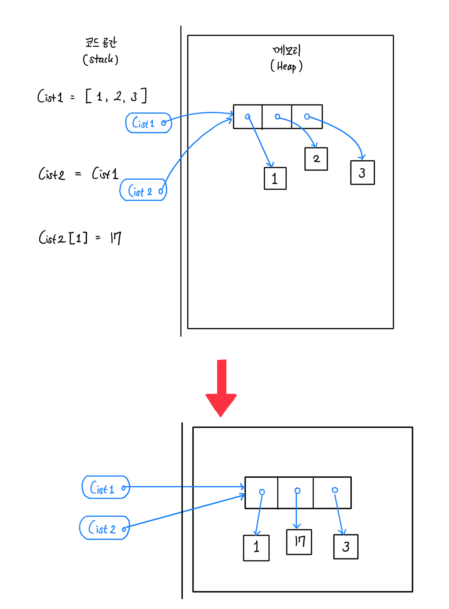
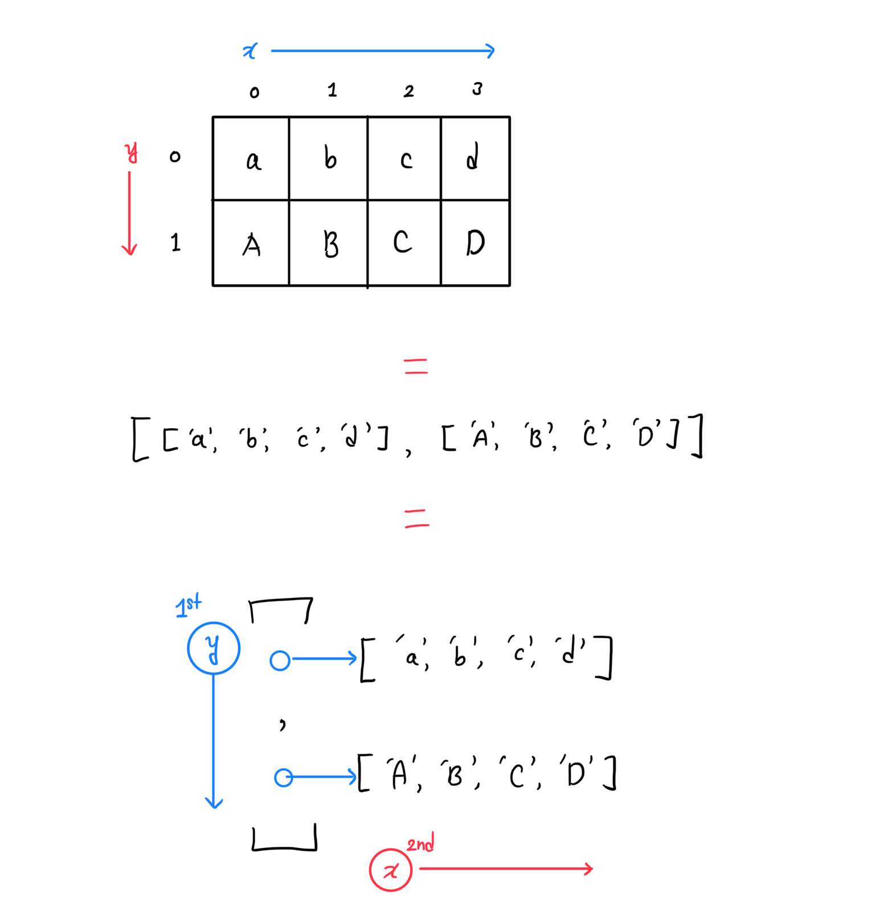
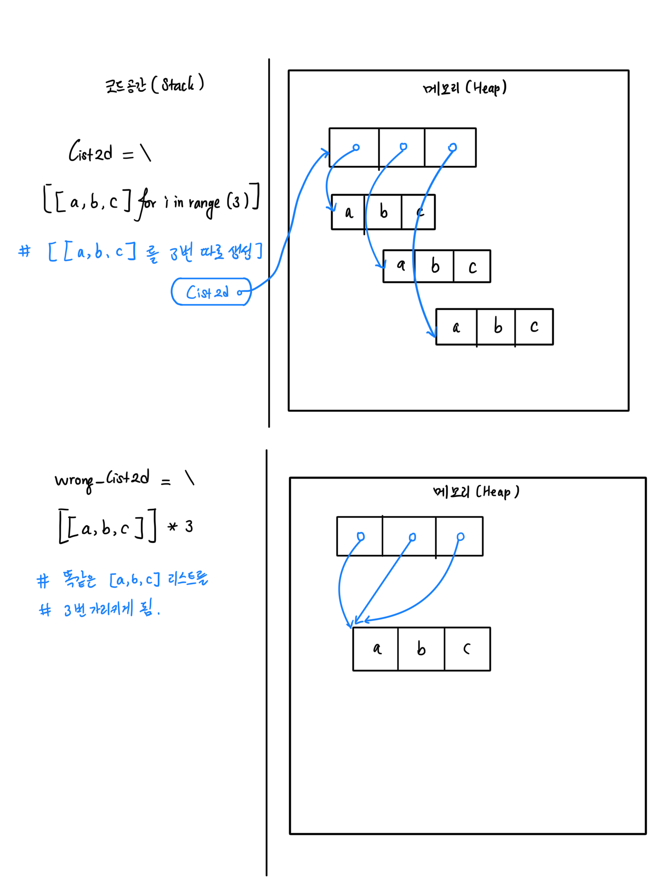

### Coding Practices - Day 3
@TravisAhn100
@anto5710

#### Today's Goals
1. 주크박스(music.py) 완성
2. 메모리 구조 리뷰
3. 리스트 리뷰
4. 2차원 리스트 개요
5. 2차원 리스트 예제: 체스 보드

#### Jukebox (music.py)
```python
import musicalbeeps as MB
note_strs_list = list(input())
player = MB.Player(volume = 0.5)
for c in note_strs_list:
    player.play_note(c, 1.0)
```
반복문을 사용하여 간단한 주크박스를 구현해보았습니다. 여기서 주의할 점은
`note_strs_list`가 스트링 리스트 이므로, `for c in note_strs_list:`을 하게 될 경우,
`note_strs_list = ["A", "B", "C"]`에서 `c="A"`, `c="B"`... 순으로 스트링 값을
순회하게 됩니다. 위치(인덱스)가 아닙니다! 반복문 변수 이름을 적절히 신경 써, 헷갈리지 않게 할 것.

#### Review: Memory Structure in Python
파이썬의 변수가 생성 될 시, 실제 변수값은 메모리 공간(Heap)에 저장되고, 코드 공간(Stack)에는
그 메모리 위치를 가리키는 태그(pointer)만이 저장됩니다.

다만, ```v = name```의 식으로 값을 대입할 경우에는 `Int`, `String`, `Bool`, `Double` 등
*작은* 값은 값만 복사가 되고, 메모리가 서로 엮이지는 않습니다.

##### Review: Python Lists
리스트도 마찬가지로, 선언 시 메모리 공간에 자리를 잡게 되며, 이에 대한 태그만 받게 됩니다.

하지만, 리스트의 경우 값을 넘길 때 값을 단순히 복사하는 것이 아니라, 메모리 주소를 넘기는
식으로 진행이 됩니다. 즉, 두 변수 모두 같은 메모리를 가리키게 됩니다.

따라서 `list2`나 `list1` 어느쪽에서 리스트를 수정하던, 똑같은 리스트에 그 변화가 적용되게 됩니다. 리스트를 복제할때 주의할 점입니다.

##### Python Lists are 'Boxed'
파이썬 리스트는 여러 타입의 데이터를 동시에 담을 수 있다는 특성을 가지고 있는데요,
이는 위 그림에 표현돼 있 듯, **리스트가 데이터를 그대로 담는 것이 아니라, 따로 각각이
떨어져 있는 리스트 값을 '가르키는' 방식으로 저장이 되기 때문입니다.** 이를 심화용어로,
'boxed' (한 번 감싼) 구조라고 합니다.

##### 2-D List
바둑판이나 테이블처럼, '2차원'으로 이루어져 (y, x)식의 인덱싱이 가능한 리스트를
2차원 리스트(배열)이라고 합니다.

2차원 리스트는 보통 '리스트에는 무슨 타입이든 넣을 수 있다'라는 특성을 이용해 만듭니다.
즉, 리스트의 리스트를 구성하는 것입니다.



2차원 리스트에서 가장 중요한 특성은, 안쪽 리스트 각각이 '줄(row)'의 역할을 하게 되기 때문에,
리스트에서 값을 찾을 때 `list2d[row]` (혹은 `list2d[y]`)의 식으로 위에서 몇 번째 **줄**인지 먼저 결정하게 된다는 것 입니다.

그 다음으로, 얻은 줄에서 옆에서 몇 번째인지, 즉 `x`좌표를 결정하여 값을 찾게 됩니다.

```python
list2d = [['a', 'b', 'c', 'd'],\
          ['A', 'B', 'C', 'D']]

0th_row         =  list2d[0]     ## ['a', 'b', 'c', 'd']
0th_row_2nd_col = 0th_row[2]     ##             ^
```

이를 압축하여 표현하면,
```python
list2d[0][2]
```
와 같은 식으로
```python
list2d[y][x]
```
2차원 인덱싱이 가능합니다.

* 가장 중요한 점은, 보통 `y` (혹 `row`)가 먼저 온다는 것입니다!
* 헷갈릴 때는 바깥쪽 리스트를 옆으로 눕혀서, 각 줄이 쌓여 있는 그림을 기억해봅시다.
* 아예 `row` 대신 `y`를 사용해서 모호함을 줄일 수도 있습니다.

##### Creating 2-D List

여기서 또 주의할 점이, `[list] * 3`을 하게 되면, 그대로 3번 복사하여 `[list, list, list]`를 얻게 되는데, 이럴 경우 3개 `list`가 전부 동일한 줄을 가르키게 되어, 요상한
미러링 리스트가 된다는 문제가 발생합니다.

이를 방지하기 위해, `[[1, 2, 3] for _ in range(3)]`과 같은 식으로 `[ ... for]`
문법을 사용하여, 3번 모두 새로 리스트를 생성하도록 만들어 줍시다.


#### 2-D List Exercise - Chess Board
체스 구현을 위한 foundation으로, 간단하게 빈 체스 보드와 나이트만 구현해봅시다.

* 체스 보드는 8x8 2차원 리스트를 사용하여 저장(표현)합니다.
* 입력으로 선택할 기물의 `row`, `rank`를 받아, 움직일 위치인 `row2`, `rank2`를
 한 번 더 받는 프로그램을 짜봅시다.
* 예를 들어, "D1"의 경우 `row = 0`, `rank = 3`에 해당하게 됩니다. 체스와 달리,
 프로그래밍은 기본적으로 인덱스가 0에서 시작하므로 (zero-based), 이를 조정해줘야 합니다.
* 알파벳을 해당하는 숫자로 변환하는 방법? 또 숫자문자열을 숫자(`int`)로 바꾸는 법은?


#### Today's Assignment
* 체스 보드를 완성시켜봅시다. 체스보드를 프린트하되, 특유의 체크무늬를 구현해봅시다.
   (간단하게 [ANSI Color Sequence](https://en.wikipedia.org/wiki/ANSI_escape_code)를 사용합니다. 보이지 않는 특수신호문자 비슷한 것으로, 명령어창 폰트/배경 색깔을 바꾸는 데
   사용할 수 있습니다.)
* 나이트가 현재 이동은 가능하나, 축지법을 쓰고 있습니다 (기물 이동 제한 없음).
  보드밖으로 나가지 못하도록 제한을 줘봅시다.