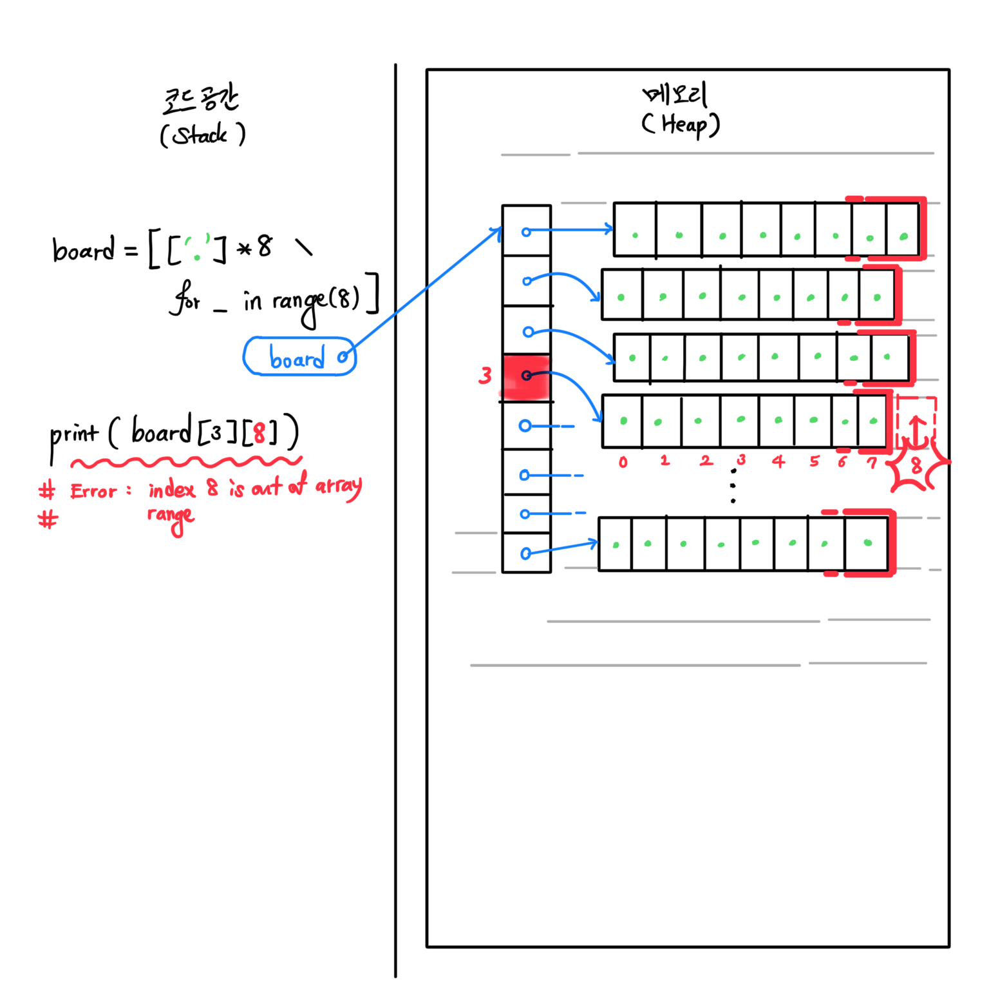

### Coding Practices - Day 4
@TravisAhn100
@anto5710


#### 2-D List Exercise: Chess Board
* 2차원 리스트 리뷰 겸, 체스 보드를 간단히 구현해봤습니다. 우선, 기본적으로 체스보드를
8x8 2D 리스트로 표현했고, 먼저 Knight의 행동을 구현해봤습니다.
* ASCII 코드 관련 리뷰도 겸하여, 랭크-로우 (체스판 좌표) 입력 시스템을 간단히 구현해봤습니다.
  E.g., `"C4"`의 경우, `row = 3`[^f], `rank = 2`로 받아야하는데, 이때 `list(input)`을 통해 두 개를 구분하고,
  알파벳 (예: `"C"`)의 경우, `ord("A")`를 빼줌으로써 알파벳⇒인덱스 변환을 한 번 더 복습해봤습니다.

##### Chess Board - Out of Index Range
1,2 차원 리스트 등 인덱싱[^i]을 할 때 필연적으로 발생하기 마련인 `index out of range`(`illegal index/read`) 문제에 대해서도
점검하는 시간을 가졌습니다.

파이썬에서 모든 실질적인 '데이터값'은 Heap 메모리에 저장됩니다. 즉, Heap은 heap of clothes (빨래 더미)라는 표현처럼, 여러 데이터가 뒤섞여있는 양상을 띄는데요, 따라서
리스트 등에서 리스트 범위를 한 칸이라도 나갈 경우, 바로 `illegal read`/`index out of range` 등 다른 메모리를 침범했다고 에러가 뜨며 프로그램이 튕기게 됩니다.




따라서 체스보드 등 딱 confined된 공간을 다룰 경우, 인덱스가 마이너스 혹은 size나 그 이상으로 넘어가 범위밖으로 나가버리는 예외(edge case)를 항상 생각해봐야합니다.

체스 프로그램의 경우, 좌표를 입력받을 때 좌표가 (0, 0) ~ (7, 7)밖으로 나가버릴 경우
이 에러가 발생합니다. 프로그램이 튕겨버리는 critical한 에러이므로 입력 받을 때 바로
확인을 해줍시다.

가장 흔한 방식은, 받는 것과 동시에 바로바로 좌표가 보드 안에 있는 지 확인을 해주는 것입니다.
문제는, 좌표 입력을 매번 받기에, 좌표 validation도 매번 해줘야 합니다. 코드가 크게 중복되고 있고, 읽기도 힘듭니다. 이를 어떻게 해결해야 할까요?

### Intro to Functions
함수는 수학에서의 함수와 크게 비슷합니다. 입력을 받고, 받은 입력을 가지고 코드를 돌려서,
나온 결과를 반환(return)하는 ***미니 프로그램***과도 같습니다. (물론 항상 무언가 결과를 반환할 필요는 없고, 무언가 다른 효과를 내는 함수도 있습니다. 리턴 없이 메시지 출력만 하는 `print()`함수가 대표적입니다.)

#### Function - Examples
우리가 지금까지 써왔던 파이썬 모듈들의 `random()`, `randrange(A, B)` 등도 전부 함수입니다.
`print()` 또한 함수이며, 여기서 함수가 `함수이름(입력1, 입력2, ...)`의 문법을 취한다는 걸 볼 수 있습니다.


#### Function - Purposes
모듈이 여러가지 함수 위주로 제공되는 것에서 알 수 있 듯, 함수는 코드를 **정리**하는데
있어 큰 의미를 갖습니다.

#### Function - Concision
코드는 일차적으로, 사람이 읽을 것을 상정하고 쓰는 것이기에, 가독성(legibility)가 매우
중요합니다 (모 미국 Big Tech CEO의 경우, 코드를 프린터로 출력해 꼼꼼히 검토한다는 말이 나올 정도니까요).
다음 코드에서 체스 보드 상 좌표 받는 부분:
```
row = ord(selection[0].lower()) - 97
rank = int(selection[1])-1
```
이 반복되고 있습니다. 이런식으로 어느정도 복잡하면서 2번 이상 반복된다 싶은 부분은
무조건, 코드를 짠 이후, 함수로 정리할 각이 보인다고 할 수 있습니다.
이 코드 토막을 함수로 재구성해봅시다.

```python
from random import random

BLACK_BG = "\033[40;97m"
WHITE_BG = "\033[107;30m"
RESET    = "\033[m"

def draw_board(board):
    line = " "
    for x in range(8):
        line += ' ' + chr(ord('A') + x)
    print(line)

    for (y, row) in enumerate(board):
        line = chr(ord('1') + y)
        for (x, cell) in enumerate(row):
            line += ' '
            if (random() < 0.5):
                line += BLACK_BG
            else:
                line += WHITE_BG
            line += cell
        line += RESET
        print(line)

# white knight= n , black knight= N
l=['.' for i in range(8)]
board= [['.' for i in range(8)]for j in range(8)]
# print(board)

knight='♘'

board[0][ 1]=knight
board[0][-2]=knight

draw_board(board)
# for line in board:
#     print(line)

selection = list(input())
row = ord(selection[0].lower()) - 97
rank = int(selection[1])-1

print(f"row: {row}, rank: {rank}")

if board[rank][row]=='.':
    print('.')
if board[rank][row]=='♘':
    print('selected')
    movement = list(input())
    row2 = ord(movement[0].lower()) - 97
    rank2 = int(movement[1])-1


    print(f"row2: {row2}, rank2: {rank2}")

    board[rank][row]='.'
    board[rank2][row2]='♘'
    for line in board:
        print(line)
```

우선, 함수를 만들 때는 무엇을 매개변수(parameter)으로 받아야 하는지 정하는 것이 중요합니다.
함수가 할 일을 정확하고 구체적으로 정해야하는데, 이 일은 big step task여야합니다.

즉 구체적이지만 또 어느정도 실속이 있는 확실한 임무를 주는 것이 관건입니다.
이를 정하는 건 어느 정도 경험을 요하는 일이기도 합니다.

이 함수의 경우, 2차원 리스트인 체스 board를 받아, 키보드입력으로 "A1" 식의
체스보드 좌표를 받아 `[y, x]` 형식으로 해당 (2차원) 인덱스를 반환하는 것으로 합시다.

```python
"""
purpose: selects an (y,x) coord from user input.
         if couldn't, repeats until it can
input  : chess board
returns: a *valid* pair of coord (y, x)
"""
def select_coord(board):
    selection = list(input())
    x = int(ord(selection[0].lower())) - 97
    y = int(selection[1])-1

    return [y, x]
```
이제, 위 코드 토막을 반복했던 부분에 `select_coord(board)` 한 줄로만 대체해주면
코드 중복이 사라지고, 전체적으로 간결해지는 걸 볼 수 있습니다.

이러한 refactoring (코드 정리) 기능이 함수의 장점 중 하나입니다.

###### Function Contract
함수에 정확한 설명문을 작성해주는 것도 중요합니다. 이를 함수 컨트랙트 (function contract)라 하며, 함수 사용자 뿐만 아니라 이후 타 프로그래머가 코드를 유지, 보수하는데도 큰 도움이 됩니다 (본인도 시간 지난 후 코드를 다시 볼 때 기억을 떠올리는데도 크게 유용합니다).

이런 설명문은 크게 정형화가 돼있으며, 1. 목적 (purpose), 2. 매개변수 (params), 3. 반환값 (returns) 4. 부가효과 (effects), 5. 주의점/오류가능성 (note) 등을 포함합니다.
코드 복잡성을 고려하여 적절히 4, 5까지 추가해줄 수도 있습니다.


##### Function - Abstraction
코드는 쓰고 나면 하는 일은 단순하지만 표현/로직이 꽤 복잡해 보이는 경우가 있습니다.
위의 체스 좌표 입력 코드가 그 예시입니다. 단순히 좌표를 한 번 입력받는 것이지만,
ASCII 코드 변환 등 로직이 들어가며, 코드가 꽤 복잡해 보입니다.

이런 *복잡성을 숨기는* 방법으로, **함수로 해당 코드 토막을 빼버리는 것**이 있습니다.
이런 복잡한 코드를 빼서 숨기는 행위를 'abstraction' (추상화)라고 합니다.

예를 들어, `random` 모듈의 `random()` (난수 생성은 상당히 복잡한 계산을 요합니다)
 함수나 파이썬 기본 함수 `print()` (OS 터미널과 상호작용하여 많은 스트링이라도 빠르게 출력할 수 있도록 조금 복잡한 구조가 돼있습니다) 등,
쓰기는 간단하지만 내부 구조는 뜯어보면 상당히 복잡한 코드들이 있습니다.
하지만, 함수로 빼고, 정확히 하는 일을 설명해줌으로써, 사용자 입장에선 매우 간편하게
사용할 수 있도록 해주고 있습니다.

##### Function - Modularity
또한 이런식으로 조금 어렵거나 복잡한 부분을 따로 따로 모음으로써 코드의 모듈화를 가능케합니다. 즉, 코드를 로봇처럼 여러 독립된 파츠로 나눠서, 각각 부분을 세부 관리할 수 있도록 하는 것입니다. 헨리 포드의 자동차 공장 Assembly Line 공정화에도 비유할 수 있습니다.

```python
from random import random

BLACK_BG = "\033[40;97m"
WHITE_BG = "\033[107;30m"
RESET    = "\033[m"

"""
purpose: validates the movement for the knight
input  : from & to coordinates
returns: (True/False) wheter the move is legal for the knight
"""
def knight_movement(board, y, x, y2, x2):
    mal_movement=[[y+1,x+2],[y+1,x-2],[y-1,x+2],[y-1,x-2],[y+2,x+1],[y+2,x-1],[y-2,x+1],[y-2,x+1]]
    for c in mal_movement:
        if [y2,x2] == c:
            return True
    return False

"""""
purpose: validates the movement for the knight
input  : from & to coordinates
returns: whether the move is legal for the rook
"""""
def rook_movement(board, y, x, y2, x2):
    seung_movement=[]
    for c in seung_movement:
        if [y2,x2] == c:
            return True
    return False

"""
purpose: selects an (y,x) coord from user input.
         if couldn't, repeats until it can
input  : chess board
returns: a *valid* pair of coord (y, x)
"""
def select_coord(board):
    while True:
        selection = list(input())
        x = int(ord(selection[0].lower())) - 97
        y = int(selection[1])-1
        if y>=8 or x>=8 or y<0 or x<0:
            print('invalid move')
            continue
        else:
            break
    return [y, x]

"""
purpose: prints the coord of the piece
input  : coordination of the selected piece
effect : prints message to standard output
"""
def coord_message(y, x, p):
    if p=='♘':
         print('%s %s selected.'% ('knight',[x+1,y+1]))
    if p=='♖':
        print('%s %s selected.'% ('rook',[x+1,y+1]))

def draw_board(board):
    line = " "
    for x in range(8):
        line += ' ' + chr(ord('A') + x)
    print(line)

    for (y, row) in enumerate(board):
        line = chr(ord('1') + y)
        for (x, cell) in enumerate(row):
            line += ' '
            if y%2==1:
                if x%2==0:
                    line += BLACK_BG
                if x%2==1:
                    line += WHITE_BG
            if y%2==0:
                if x%2==0:
                    line += WHITE_BG
                if x%2==1:
                    line += BLACK_BG
            line += cell
        line += RESET
        print(line)

# white knight= n , black knight= N
l=['.' for i in range(8)]
board= [['.' for i in range(8)]for j in range(8)]
# print(board)

knight = '♘'
rook = '♖'
board[0][ 1]=knight
board[0][-2]=knight
# board[0][-3]=bishop
# board[0][2]=bishop
board[0][0]=rook
board[0][7]=rook

draw_board(board)

while True:
    [y, x] = select_coord(board)
    if board[y][x] == '♘':
       coord_message(x,y,board[y][x])
    print(f"row: {x+1}, rank: {y+1}")

    if board[y][x]=='.':
        print('blank')
        continue

    [y2, x2] = select_coord(board)

    if board[y][x] == '♘':
        coord_message(x,y,board[y][x])

        knight_movement(board, y, x , y2 , x2)
        if knight_movement(board, y, x , y2 , x2) == False:
            print('invalid movement')
            continue
        board[y][x]='.'
        board[y2][x2]='♘'
        draw_board(board)
    if board[y][x] == '♖':
        coord_message(x,y,board[y][x])
        [y2 , x2] = select_coord(board)
        print(f"row2: {x2+1}, rank2: {y2+1}")
        board[y][x]='.'
        board[y2][x2]='♖'
        draw_board(board)
```
위는 현재까지 구현한 체스 코드를 함수 위주로 refactoring한 결과입니다.
전체적으로, 코드가 큰 한뭉텅이 스파게티 코드에서, `knight_movement()`, `rook_movement()`, `select_coord()` 등 확실하게 파트가 구분이 된 모습입니다.

이런 식으로 모듈이 딱딱 나눠질 경우, 코드가 중복된 부분이 줄어드는 것과 더불어,
서로 의존도가 줄어들게 됩니다.
따라서, 함수의 큰 틀만 유지하는 한, 함수 내 세부 사항은 언제든지 수정이 가능하고,
여러 프로그래머가 팀으로 개발할 경우, *분담작업*을 쉽게 해줍니다. (내가 변수 하나 이름을 바꿨다고, 그 밑으로 줄줄 그 변수 쓰던 코드 전부가 에러가 나는 일을 방지할 수 있겠죠.)


#### Function - Its Anatomy
함수 작동 워크 플로우는 수학에서와 상당히 비슷합니다. 입력 -> 처리 -> 결과를 붙여넣기(Ctrl + V)의 과정을 거치는데요, 즉 다음 코드의 경우,

```python
"""
purpose: converts given single (lower/upper) alphabet character
         to its corresponding order in alphabet [0 .. 25],
         e.g. returning 1 for 'b'
input  : single alphabet char, upper or lower
returns: corresponding index, 0 <= i < 26
note   : may result in unexpected behavior given non-alphabet char
"""
def alphabet_to_index(c):
        lower_ascii = ord(c.lower())
        index       = lower_ascii - ord('a')
        return index

msg = "hahaha: " + alphabet_to_index('Z')
print(msg)
```

`msg = ...` 줄에서 함수 호출 `alphabet_to_index('Z')`이 걸리며, `c = 'Z'` 받으면서
함수 코드가 한줄 한줄 돌아가기 시작하는데요, 최종적으로 `index` (이 경우 `= 25`)가 리턴되면서
```python
msg = "hahaha: " + 25
```
최종적으로 코드가 위와 같은 양상으로 진행되게 됩니다. 마치 주어진 매개변수 입력으로
미니 프로그램을 돌리고,
그 결과를 그대로 붙여넣은 (대입한) 느낌이지요.

### Technique: Hard-coding List of Delta Coordinates
오늘 나이트 움직임을 구현하면서, 나이트가 움직일 수 있는 8가지 가능성을
검토하는데 있어 구현에 어려움이 있었는데요, 이를 *압축*하여 표현할 수 있는 방법으로
모든 가능성을 리스트에 미리 넣어놓고 순회하는 방식을 도입하였습니다.

```python
"""
purpose: validates the movement for the knight
input  : from & to coordinates
returns: (True/False) wheter the move is legal for the knight
"""
def knight_movement(board, y, x, y2, x2):
    mal_movement=[[y+1,x+2],[y+1,x-2],[y-1,x+2],[y-1,x-2],[y+2,x+1],[y+2,x-1],[y-2,x+1],[y-2,x+1]]
    for c in mal_movement:
        if [y2,x2] == c:
            return True
    return False
```
이런 식으로 모든 페어를 리스트에 한데 넣어, `if`문을 8번 작성할 수고를 덜었습니다.
이는 체스나 미로 경로 찾기와 같이 주위 (360도) n방향으로 계속 이동해야 하는
코드에서 유용하게 사용됩니다. 효율은 `if`를 넣을 때나 크게 차이가 없지만, 읽는
사람 입장에서도 간결하고, 또 각 경우에서 해줘야할 처리가 많은 경우 그 코드를 한 번만
 넣어줘도 되는, 중복을 줄여주는 효과도 있습니다.

### Today's Assignment
오늘은 주로 저번 시간의 체스 보드 프로그램을
함수 개념을 도입하여 수정, 개선하는 시간을 가졌습니다.
Knight 움직임을 완성시켰으므로, Rook의 행동도 비슷하게 구현해봅시다.

[^f]: 체스와는 다르게, 우리가 구현한 저장구조는 2-D 리스트이기에, index가 0부터 시작합니다 (zero-based).
[^i]: 숫자위치로 값을 찾는 행위